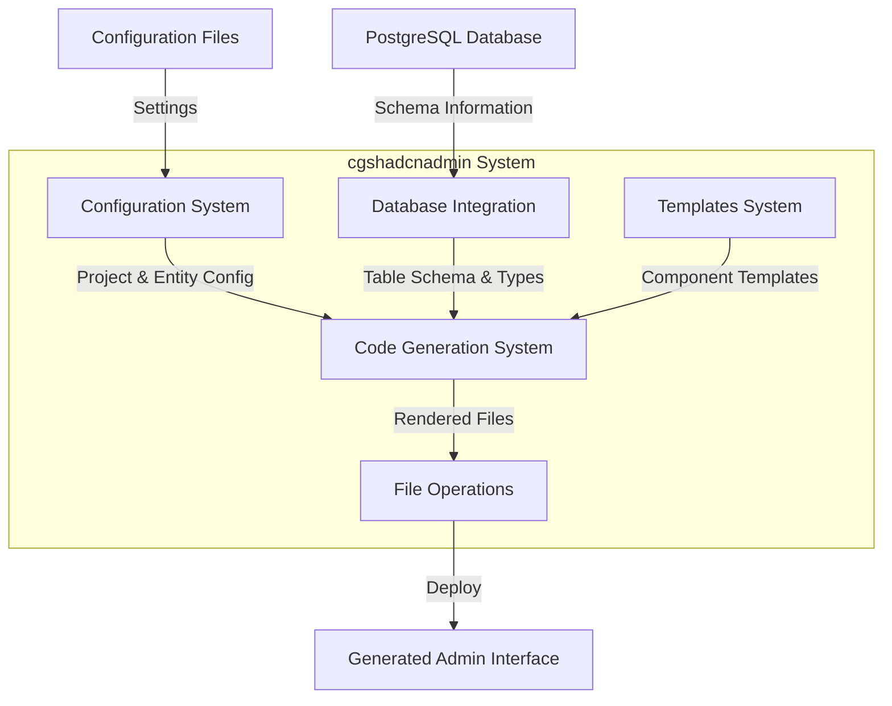
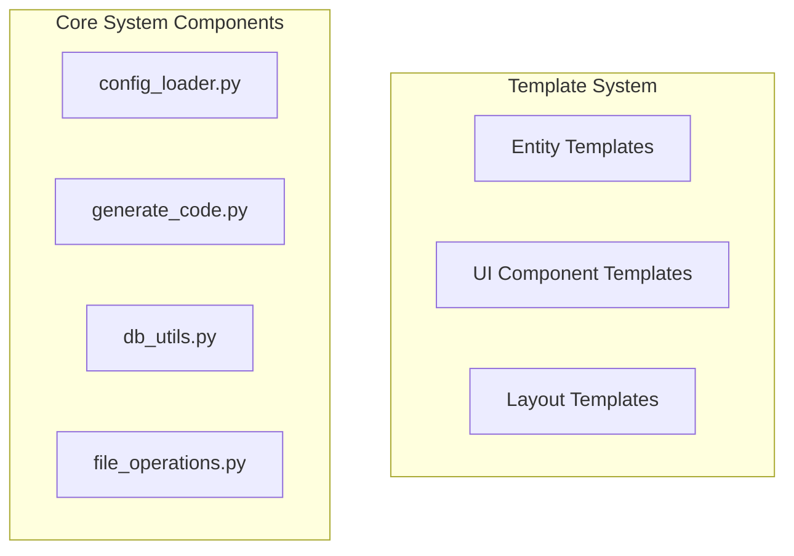
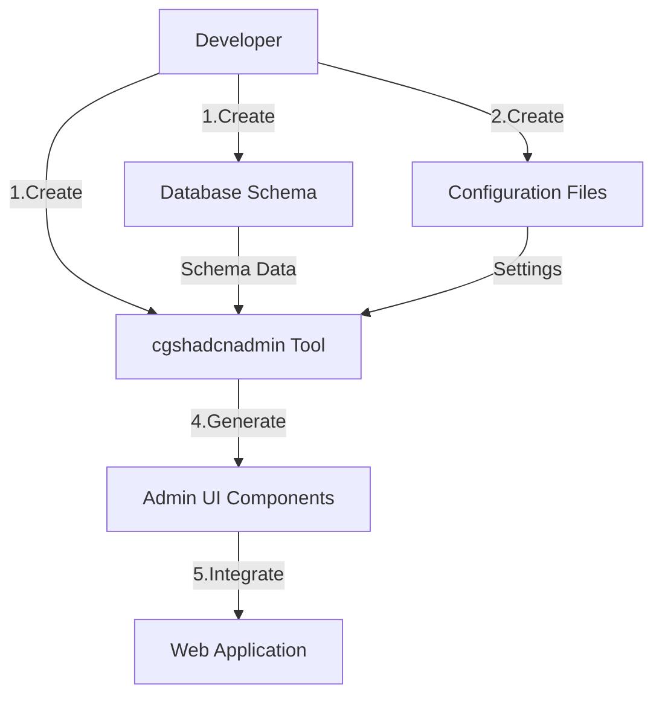
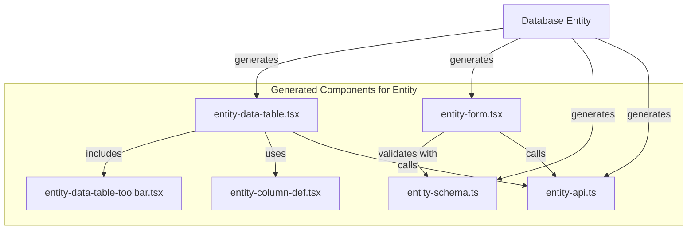

# Overview  概述

> **Relevant source files  相关源文件**
> * [LICENSE](https://github.com/flashtony2005/cgshadcnadmin/blob/8f280571/LICENSE)
> * [README.md](https://github.com/flashtony2005/cgshadcnadmin/blob/8f280571/README.md)

This document provides an introduction to cgshadcnadmin, a code generation tool for automatically creating admin interfaces using shadcn UI components based on database schemas. cgshadcnadmin streamlines the development process by generating ready-to-use admin panels with modern UI components, reducing boilerplate code, and accelerating development workflows.本文档介绍了 cgshadcnadmin，这是一个基于数据库模式自动创建管理界面的代码生成工具。cgshadcnadmin 通过生成现代 UI 组件的现成管理面板，简化开发流程，减少样板代码，并加速开发工作流。

## What is cgshadcnadmin?  什么是 cgshadcnadmin？

cgshadcnadmin is a specialized code generation utility that automates the creation of administrative interfaces for web applications. It connects to your database, reads schema information, and generates a complete set of TypeScript/React components to create a fully functional admin panel with the following features:cgshadcnadmin 是一个专门的代码生成工具，用于自动化创建 Web 应用的管理界面。它连接到您的数据库，读取模式信息，并生成一套完整的 TypeScript/React 组件，以创建一个功能齐全的管理面板，具有以下功能：

* Data tables with sorting, filtering, and pagination数据表格，支持排序、过滤和分页
* Form components for creating and editing records用于创建和编辑记录的表单组件
* Validation based on database schema constraints基于数据库模式约束的验证
* Modern UI with shadcn components基于 shadcn 组件的现代 UI
* TypeScript type safety throughoutTypeScript 类型安全

The system eliminates the repetitive task of manually creating CRUD interfaces for database entities, allowing developers to focus on business logic and custom functionality.该系统消除了手动为数据库实体创建 CRUD 界面的重复性任务，使开发者能够专注于业务逻辑和自定义功能。

Sources: [README.md](https://github.com/flashtony2005/cgshadcnadmin/blob/8f280571/README.md)

  来源：README.md

## System Architecture Overview  系统架构概述

The cgshadcnadmin system consists of several interconnected subsystems that work together to generate code based on database schemas and configuration files.cgshadcnadmin 系统由几个相互连接的子系统组成，这些子系统协同工作，根据数据库模式和配置文件生成代码。

The system follows a pipeline architecture where configuration and database schema information flow through various processing stages to produce the final output: a set of TypeScript/React components forming an admin interface.该系统遵循管道架构，配置和数据库模式信息通过多个处理阶段流动，最终生成输出：一套 TypeScript/React 组件形成的后台管理界面。

For detailed information about each subsystem, see:有关每个子系统的详细信息，请参阅：

* [Configuration System  配置系统](/flashtony2005/cgshadcnadmin/2.1-configuration-system)
* [Code Generation Pipeline代码生成流程](/flashtony2005/cgshadcnadmin/2.2-code-generation-pipeline)
* [Database Integration  数据库集成](/flashtony2005/cgshadcnadmin/2.3-database-integration)
* [File Operations  文件操作](/flashtony2005/cgshadcnadmin/2.4-file-operations)
* [Templates and Rendering  模板和渲染](/flashtony2005/cgshadcnadmin/3-templates-and-rendering)

Sources: [README.md](https://github.com/flashtony2005/cgshadcnadmin/blob/8f280571/README.md)

  来源：README.md

## Key Components and Code Structure  关键组件和代码结构

cgshadcnadmin's codebase is organized into several key modules that handle different aspects of the code generation process:cgshadcnadmin 的代码库被组织成几个关键模块，这些模块处理代码生成过程中的不同方面：

Each component has a specific role in the code generation process:每个组件在代码生成过程中都有特定的作用：

* **Configuration Loader**: Manages environment variables and YAML configuration配置加载器：管理环境变量和 YAML 配置
* **Database Utilities**: Connects to databases and extracts schema information数据库工具：连接到数据库并提取模式信息
* **Code Generator**: Processes templates with context data to generate code代码生成器：使用上下文数据处理模板以生成代码
* **File Operations**: Handles file system operations for the generated code文件操作：处理生成的代码的文件系统操作
* **Templates**: Provides the structure for the generated components模板：为生成的组件提供结构

Sources: [README.md](https://github.com/flashtony2005/cgshadcnadmin/blob/8f280571/README.md)

  来源：README.md

## Typical Workflow  典型工作流程

The typical workflow for using cgshadcnadmin follows these steps:使用 cgshadcnadmin 的典型工作流程遵循以下步骤：

1. Define your database schema (tables, columns, relationships)定义您的数据库模式（表、列、关系）
2. Configure cgshadcnadmin through environment variables and YAML configuration通过环境变量和 YAML 配置配置 cgshadcnadmin
3. Run the code generation command运行代码生成命令
4. The system connects to your database and extracts schema information系统连接到您的数据库并提取模式信息
5. Templates are rendered with the schema context to generate UI components使用模式上下文渲染模板以生成 UI 组件
6. Generated files are written to the output directory生成的文件写入输出目录
7. Files are copied to your frontend project structure
8. The admin interface is ready to use in your application

This automated process significantly reduces development time for admin interfaces and ensures consistency across your application.

Sources: [README.md](https://github.com/flashtony2005/cgshadcnadmin/blob/8f280571/README.md)

## Generated Admin Interface Components

cgshadcnadmin generates a comprehensive set of UI components for each entity in your database. These components are built using the shadcn UI library and follow modern React patterns.

The generated code includes:

| Component Type | Purpose | Features |
| --- | --- | --- |
| Data Tables | Display and manage entity records | Sorting, filtering, pagination |
| Form Components | Create and edit entity records | Field validation, error handling |
| Detail Views | Display detailed entity information | Formatted field display |
| Navigation | Access different entity sections | Organized menu structure |
| Layout Components | Structure the admin interface | Responsive design |
| Dialog Components | Modal interactions | Confirm delete, edit in modal |

For more details on the generated UI components, see:

* [Data Table Components](/flashtony2005/cgshadcnadmin/4.1-data-table-components)
* [Layout Components](/flashtony2005/cgshadcnadmin/4.2-layout-components)
* [Dialog and Command Components](/flashtony2005/cgshadcnadmin/4.3-dialog-and-command-components)

Sources: [README.md](https://github.com/flashtony2005/cgshadcnadmin/blob/8f280571/README.md)

## Benefits and Use Cases

cgshadcnadmin is particularly useful for:

* Rapid prototyping of administrative interfaces
* Projects with many database entities requiring CRUD operations
* Teams that want to maintain consistency across admin interfaces
* Developers who want to focus on business logic rather than boilerplate UI code
* Applications that need to quickly adapt to database schema changes

The main benefits include:

* Reduced development time for admin interfaces
* Consistent UI across all entities
* Type-safe code with TypeScript integration
* Modern UI using shadcn components
* Automatic adaptation to schema changes

Sources: [README.md](https://github.com/flashtony2005/cgshadcnadmin/blob/8f280571/README.md)

## Getting Started

To begin using cgshadcnadmin, refer to the [Usage Guide](/flashtony2005/cgshadcnadmin/7-usage-guide) which provides detailed instructions on installation, configuration, and code generation. The [Configuration Reference](/flashtony2005/cgshadcnadmin/5-configuration-reference) offers a comprehensive overview of all available configuration options.

Sources: [README.md](https://github.com/flashtony2005/cgshadcnadmin/blob/8f280571/README.md)
